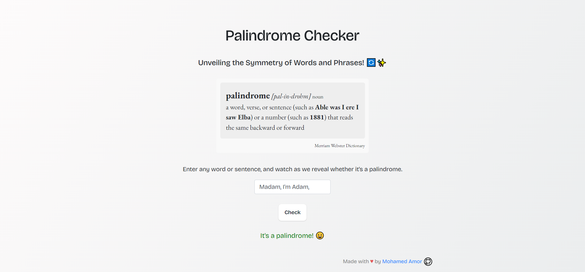

# Palindrome Checker

Welcome to the Palindrome Checker project! This web application allows you to determine whether a given word or phrase is a palindrome.

## Table of Contents

- [Introduction](#introduction)
- [Features](#features)
- [Usage](#usage)
- [Technologies](#technologies)
- [License](#license)

## Introduction

Palindromes are words, phrases, or sequences that read the same forwards as they do backwards. The Palindrome Checker application helps you quickly identify whether a given input is a palindrome or not. The application takes advantage of JavaScript and Bootstrap to create a user-friendly interface for checking palindromes.

## Features

- Input validation: The application checks if the entered input is a palindrome, considering letters and numbers while ignoring special characters and spaces.
- User-friendly interface: The application provides a clean and intuitive interface to enter input and see the result.
- Keyboard shortcut: Users can press the "Enter" key after typing to check whether the input is a palindrome.

## Usage

1. Enter a word or phrase in the input field.
2. Click the "Check" button or press the "Enter" key.
3. The application will display whether the entered text is a palindrome or not.

## Technologies

- HTML
- CSS (Bootstrap)
- JavaScript

## Deployment

The Palindrome Checker app is deployed and accessible at: [https://palindrome-purplegem903.vercel.app/](https://palindrome-purplegem903.vercel.app/)

## License

This project is licensed under the [MIT License](LICENSE).
